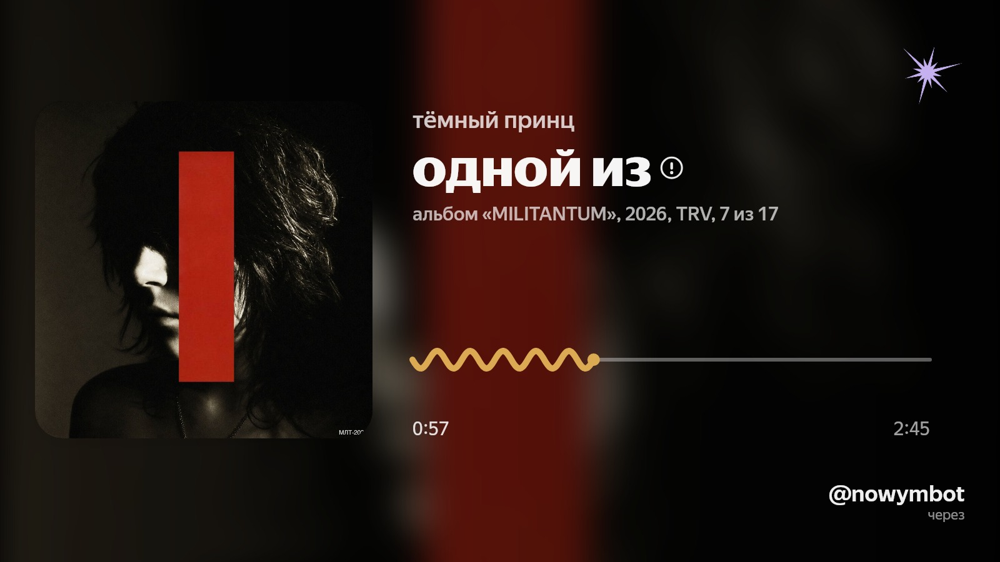
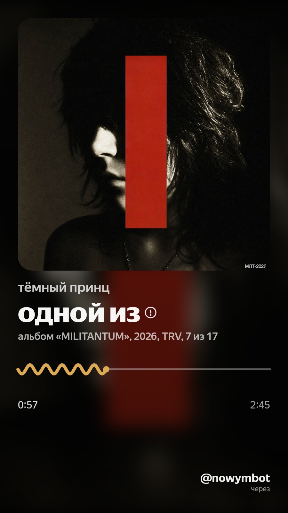

<p align="center">
  
</p>

<p align="center">
  <a href="https://nodejs.org"></a>
  <a href="https://www.typescriptlang.org"></a>
  <a href="https://gramio.dev"></a>
  
  <a href="LICENSE"></a>
  
</p>

Бот для Яндекс Музыки в Telegram. Инлайн-поиск, карточка «сейчас играет»,
выгрузка альбомов, лирика, свой кэш-канал вместо повторных закачек. На
[GramIO](https://gramio.dev/) 0.12.

## Ништяки

- 🔎 инлайн-поиск треков — `@bot название`, ссылка на трек/альбом, «недавнее»
  (история прослушиваний, с пагинацией и бесконечным скроллом), или вообще
  пусто (тогда отдаёт текущий трек). Опечатки подправляет Yandex suggest;
- 🖼 карточка «сейчас играет» — ambient-рендер на `@napi-rs/canvas`, рендер
  уходит в пул воркеров, чтобы не блокировать event loop;
- ⚡ аудио-эффекты прямо в инлайне — `@bot ncore название` /
  `@bot speed название` / `@bot slow название` (nightcore / ускорение /
  замедление+реверб), реальный DSP через ffmpeg, результат кэшируется
  отдельно от оригинала;
- ❤️ лайк/анлайк трека кнопкой под треком;
- 🎚 выбор качества звука — `best` / `economy` / `lossless` (для lossless —
  расшифровка CDN-ссылок на лету);
- 📦 выгрузка альбома пачками (`sendMediaGroup`) — с прогрессом, отменой,
  повтором упавших треков, возобновлением после рестарта бота, без OOM даже
  на здоровенных аудиокнигах;
- 💾 свой кэш-канал в Telegram вместо повторных закачек с Яндекса —
  пустышка → реальная заливка, stale-refresh по расписанию;
- 📝 лирика строкой-цитатой — Genius (по фразе, потом по автору/треку),
  фолбэк на Yandex, если не нашлось;
- 🔐 device-flow логин, токены шифруются at-rest (Fernet), ws-наблюдатель
  за плеером владельца (Ynison);
- `/start`, `/help`, `/np`, `/settings`, `/login`, `/logout`, админские
  `/health`, `/broadcast` (с подтверждением и остановкой на лету).

## ⚡ Быстрый старт

Порядок важен: два шага в BotFather — самая частая причина «бот молчит»,
без них бот заведётся и будет выглядеть рабочим, но инлайн не заработает.

1. **Бот в [@BotFather](https://t.me/BotFather):** `/newbot` → токен;
   `/setinline` → любая заглушка подсказки (например `ищу трек...`) —
   **обязательно**, без этого инлайн (`@bot запрос`) не работает вообще;
   `/setinlinefeedback` → выбери бота → `100%` — **обязательно**, иначе
   Telegram присылает `chosen_inline_result` (сигнал «юзер выбрал трек,
   качай») только для доли запросов, и большинство выборов зависают на
   плейсхолдере навсегда.
2. **Канал-кэш:** создай приватный канал, добавь бота админом (права на
   публикацию и удаление сообщений). Узнать numeric id: перешли любое
   сообщение ИЗ канала боту [@userinfobot](https://t.me/userinfobot) —
   формат `-100xxxxxxxxxx`. Свой telegram id (для `ADMIN_USER_ID`) там же.
3. **Клонируй и поставь:**
   ```bash
   git clone <url> nowym && cd nowym
   ./install.sh
   ```
   Спросит токен/id канала/твой id (Enter — пропустить и дозаполнить в
   `.env` вручную), сам сгенерит секреты, при постгресе под рукой —
   накатит роли и пропишет DSN сам.
4. **Подключение к Telegram** — выбери один способ:
   - **self-hosted Bot API сервер** (рекомендуется — без домена и TLS,
     поднимается локально за пару минут):
     ```bash
     # api_id/api_hash — на my.telegram.org → API development tools (создать приложение)
     docker run -d --name telegram-bot-api --restart always \
       -e TELEGRAM_API_ID=<api_id> -e TELEGRAM_API_HASH=<api_hash> \
       -p 127.0.0.1:8081:8081 aiogram/telegram-bot-api:latest
     ```
     В `.env`: `BOT_API_BASE_URL=http://127.0.0.1:8081/bot` (именно с `/bot`
     на конце — токен и метод бот доклеивает сам).
   - **облачный webhook** — если уже есть домен с TLS-сертификатом (certbot
     и т.п.): заполни `WEBHOOK_HOST`/`WEBHOOK_SSL_CERT`/`WEBHOOK_SSL_KEY` в
     `.env`, `BOT_API_BASE_URL` оставь пустым.
5. **Запуск:** `npm run start` (или `pm2 start ecosystem.config.cjs` —
   `install.sh` уже подогнал в нём пути под эту машину).

Если что-то не так — бот скажет прямо на старте (например явно укажет,
какая переменная в `.env` не задана), падать молча со временем не должен.

## Как выглядит карточка

Ambient-рендер «сейчас играет» — обложка, размытая в фон, прогресс-бар,
мета-строка (альбом/тип/год/лейбл/номер трека). Два формата: `16:9` под
фото-сообщение, `9:16` под сторис/шортсы.

<p align="center">
  
</p>
<p align="center">
  
</p>

Есть и лирик-режим — вместо прогресс-бара лента строк текста вокруг активной
(Genius → Yandex fallback):

<p align="center">
  
</p>
<p align="center">
  
</p>

## Аудио-эффекты

Не настройка, а префикс инлайн-запроса — результат летит через ffmpeg и
кэшируется отдельно от оригинального трека:

```
@bot ncore название трека   — nightcore (ускорение + питч вверх)
@bot speed название трека   — ускорение без питч-шифта
@bot slow название трека    — замедление + реверб
```

## Настройки (`/settings`)

Качество звука (`best`/`economy`/`lossless`), формат ответа (кнопка/текст/
всё/ничего — отдельно для трека и для карточки), какие поля показывать на
карточке (альбом/тип/год/лейбл/номер трека/аватар), стиль прогресс-бара
(`wavy`/`bar`), соотношение сторон карточки (`16:9`/`9:16`).

## Стек

[GramIO](https://gramio.dev/) 0.12 + `@gramio/dialogs` (меню/настройки) +
`@gramio/format` + `@gramio/storage-redis` + `@napi-rs/canvas` (рендер
карточки) + `undici`/`node-wreq`.

### Системные зависимости

Кроме Node.js нужны на машине (не npm-пакеты):

- **PostgreSQL** — две базы (users/cache), см. ниже;
- **Redis** — для `@gramio/dialogs`;
- **ffmpeg** — только для аудио-эффектов (`ncore`/`speed`/`slow`, см. ниже);
  без него всё остальное работает, просто эта фича упадёт с понятной ошибкой;
- **Docker** — опционально. Либо только для self-hosted Bot API сервера
  (см. «Быстрый старт» — без домена/TLS через него проще всего), либо для
  всей установки целиком через `docker-compose.yml` (см. «Через Docker»
  ниже) — тогда Postgres/Redis тоже не нужно ставить на хост руками.

Debian/Ubuntu:

```bash
sudo apt install postgresql redis-server ffmpeg
```

## Как поставить

`./install.sh` из «Быстрого старта» выше делает всё это за один проход:
проверит node, поставит зависимости, подготовит `.env` (секреты сгенерит
сам; спросит токен/id канала/твой id и впишет их же), при доступном
постгресе — накатит роли и пропишет `POSTGRES_*_DSN` сам (пароли
сгенерены, руками синхронизировать не с чем), проверит redis/ffmpeg,
подгонит `ecosystem.config.cjs` под текущую машину, прогонит typecheck
как smoke-тест.

Руками — то же самое по шагам:

```bash
npm install
cp .env.example .env
```

### Через Docker

Альтернатива `install.sh` — `docker-compose.yml` поднимает бота вместе с
Postgres и Redis, без ручной установки чего-либо на хост-машину кроме
Docker:

```bash
cp .env.example .env
# заполни .env: TELEGRAM_BOT_TOKEN/TELEGRAM_CHANNEL_ID/ADMIN_USER_ID,
# POSTGRES_USERS_DSN/POSTGRES_CACHE_DSN (host — `postgres`, не 127.0.0.1),
# NOWYM_USERS_PASSWORD/NOWYM_CACHE_PASSWORD (те же пароли, что в DSN),
# REDIS_HOST=redis, TOKEN_ENCRYPTION_KEY/WEBHOOK_SECRET/NOW_PLAYING_TOKEN
# (сгенерить: node -e 'console.log(require("crypto").randomBytes(32).toString("base64url"))')
docker compose up -d --build
```

Postgres-роли (`nowym_users_app`/`nowym_cache_app`) создаются автоматически
при первом старте контейнера (`docs/sql/docker-init.sh`), схему таблиц
внутри баз бот накатывает сам, как и везде. Подключение к Telegram — тот же
выбор `BOT_API_BASE_URL`/`WEBHOOK_HOST` из «Быстрого старта» выше (self-hosted
Bot API сервер удобнее поднять отдельным контейнером рядом, см. пример там).

### Переменные `.env`

Обязательные (без них бот не стартует — упадёт с явной ошибкой, какой
переменной не хватает):

| Переменная | Назначение |
|---|---|
| `TELEGRAM_BOT_TOKEN` | токен бота от @BotFather |
| `TELEGRAM_CHANNEL_ID` | id служебного канала-кэша (бот — админ канала) |
| `TOKEN_ENCRYPTION_KEY` | ключ шифрования токенов в БД (`install.sh` генерит сам) |
| `POSTGRES_USERS_DSN` | DSN базы пользователей |
| `POSTGRES_CACHE_DSN` | DSN базы кэша |
| `BOT_API_BASE_URL` **или** `WEBHOOK_HOST` | один из двух обязателен — способ получать апдейты от Telegram, см. «Быстрый старт» |

Функционально обязательна, хоть и не проверяется на старте:
`ADMIN_USER_ID` — без него `/health`/`/broadcast` недоступны никому
(гейт fail-closed) и алерты об ошибках в личку админу не шлются.

Опционально: `GENIUS_TOKEN` (лирика точнее — ключ на genius.com/api-clients),
`OWNER_ID` (кто в Ynison-наблюдателе, по умолчанию = `ADMIN_USER_ID`),
`WEBHOOK_PATH`/`WEBHOOK_SECRET`/`WEBHOOK_SSL_CERT`/`WEBHOOK_SSL_KEY`
(детали облачного webhook-режима), `NOW_PLAYING_TOKEN` (без него `GET
/now-playing` всегда 401), `ICON_SET_NAME` (Telegram custom-emoji пак для
иконок кнопок — дефолт `tgiosicons` публичный, работает без настройки;
свой пак — через @Stickers), лимиты и размеры кэшей — дефолты и полный
список в `src/settings.ts`.

### База данных

Две изолированные Postgres-базы (users/cache). `install.sh` накатывает
роли автоматически (пароли генерит сам, тут же прописывает DSN в `.env`).
Руками — один раз:

```bash
sudo -u postgres psql -f docs/sql/init.sql   # свои пароли вместо CHANGE_ME_*
```

и те же пароли — в `POSTGRES_*_DSN` в `.env`. Схему таблиц внутри баз бот
создаёт сам при первом старте, руками накатывать не нужно.

### Redis

Нужен для стека диалогов (`@gramio/dialogs`). Дефолт — `localhost:6379`, без
пароля. `sudo apt install redis-server && sudo systemctl enable --now redis-server`.

## Запуск

```bash
npm run start       # tsx src/main.ts — webhook (облако) или long-polling (self-hosted API)
npm run dev         # то же самое, но tsx watch — авто-рестарт на изменениях
npm run typecheck   # tsc --noEmit
npm run lint         # biome check . (npm run lint:fix — почить автофиксом)
npm test            # node --import tsx --test, ~154 теста, секунд 12
```

Режим выбирается сам: задан `BOT_API_BASE_URL` → self-hosted Bot API сервер +
long-polling; пусто → облако + webhook. В webhook-режиме поднимается один
http(s)-сокет с роутами: `WEBHOOK_PATH` (апдейты Telegram, опционально
проверяется `X-Telegram-Bot-Api-Secret-Token`), `GET /now-playing` (JSON о
текущем треке владельца + недавние (`recent`, до 20 последних, из живых
трекчейнджей вотчера, без похода в Yandex API), `Authorization: Bearer
NOW_PLAYING_TOKEN`), `GET /health` и `GET /metrics` (Prometheus text —
статус пулов Postgres, hit/miss in-memory кэшей, статус Ynison-вотчера,
счётчики ошибок/rate-limit-реджектов; без авторизации, как и `/health`).
TLS — если заданы `WEBHOOK_SSL_CERT`/`WEBHOOK_SSL_KEY`.

### Прод (pm2)

В репе есть готовый `ecosystem.config.cjs` (единственный fork-инстанс,
autorestart, `--expose-gc`). Полностью портативный — `cwd`/`interpreter`
вычисляются на лету (`__dirname`/`process.execPath`), патчить или
адаптировать под сервер не нужно, работает сразу после клонирования куда
угодно.

```bash
pm2 start ecosystem.config.cjs
pm2 save          # чтобы пережило ребут (после pm2 startup)
pm2 logs nowym-ts
```

### Бэкапы

`nowym_users` хранит зашифрованные OAuth-токены — потеря базы означает,
что все переавторизуются заново. `scripts/backup.sh` дампит обе базы
(`pg_dump -Fc`), подчищает дампы старше 14 дней (`NOWYM_BACKUP_KEEP_DAYS`)
и шлёт оба файла `ADMIN_USER_ID` в личку (`TELEGRAM_BOT_TOKEN`/
`BOT_API_BASE_URL` из `.env`; на self-hosted Bot API сервере лимит на файл
2ГБ, не 50МБ как в облаке). Отправка best-effort — сбой Telegram не роняет
сам бэкап, дампы уже на диске.

```bash
./scripts/backup.sh                                    # разово, в /var/backups/nowym
crontab -e                                              # раз в сутки:
# 0 4 * * * /path/to/nowym/scripts/backup.sh >> /var/log/nowym-backup.log 2>&1

# восстановление:
sudo -u postgres pg_restore -d nowym_users --clean --if-exists /var/backups/nowym/nowym_users-*.dump
```

## Структура

| Путь | Назначение |
|---|---|
| `src/bot/` | хендлеры, диалоги-меню (`@gramio/dialogs`), сборка карточки, DI-контейнер |
| `src/bot/iconSet.ts` | резолвер премиум-эмодзи (`icon_custom_emoji_id`) под кнопки |
| `src/services/` | рендер карточки (+ пул воркеров `cardRenderPool.ts`), поиск, кэш, альбомы, рассылка. `lyricsVideo.ts` — закомментированная заготовка, не живой код |
| `src/yandex/` | клиент Yandex Music API, метаданные, лирика, Ynison |
| `src/infra/` | http-клиент, шифрование, логирование, rate-limit, ретраи 429/5xx (`floodRetry.ts`), алертер об ошибках админу (`adminAlerter.ts`) |
| `src/storage/` | пулы Postgres, схемы users/cache/settings |
| `src/tagging/` | тегирование аудио (TagLib/ffmpeg) |
| `test/` | `node:test`, ~123 штуки |
| `install.sh` | установка в одну команду (см. выше) |
| `docs/sql/init.sql` | создание Postgres-ролей и баз (bare-metal) |
| `docs/sql/docker-init.sh` | то же самое, но для первого старта postgres-контейнера |
| `Dockerfile`, `docker-compose.yml` | альтернатива `install.sh` — бот+Postgres+Redis в контейнерах |
| `scripts/backup.sh` | pg_dump обеих баз + ротация, крон-скрипт |
| `biome.json` | конфиг линтера/форматтера (`npm run lint`) |

## Если что-то сломалось

1. **Бот запускается, но `@bot запрос` ничего не отдаёт** — почти всегда
   забытый `/setinline` в BotFather. Проверить: `/setinline` без аргумента
   в диалоге с BotFather покажет текущий статус.
2. **Инлайн-выдача показывается, но выбор трека зависает на плейсхолдере
   («гружу...») навсегда** — забытый `/setinlinefeedback` → `100%` в
   BotFather. Без него Telegram шлёт `chosen_inline_result` не на каждый
   выбор, а бот именно по этому сигналу качает и подменяет плейсхолдер на
   реальное аудио.
3. **Бот не стартует вовсе** — `.env` неполный, ошибка при старте называет
   переменную явно (`X не задан в .env`). Если ругается на «ни
   BOT_API_BASE_URL, ни WEBHOOK_HOST» — см. «Быстрый старт», шаг 4, нужен
   ровно один из двух способов получать апдейты.
4. `npm run typecheck` и `npm test` — если не про конфиг, а про сам код.
5. `pm2 logs nowym-ts` и `GET /health` — если это прод. Свежий рестарт
   подхватывает `.env` и код с диска, а не то, что было закешировано
   node-процессом в памяти.

## Контрибьютинг

PR приветствуются — см. [CONTRIBUTING.md](CONTRIBUTING.md): как гонять
typecheck/lint/тесты локально и чего ждать от PR.

## Лицензия

[MIT](LICENSE) — используй как хочешь, в коммерции и не только, но
сохраняй указание оригинального авторства.
